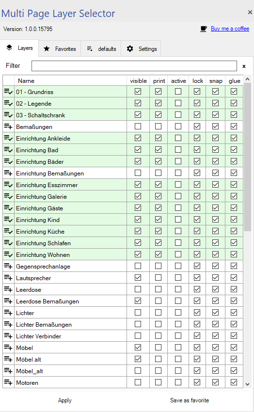
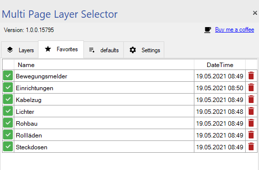
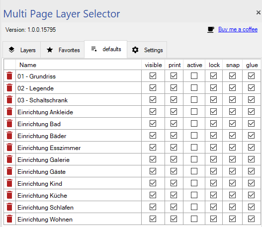
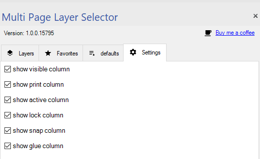

<h1>
	
	Visio - Multi Page Layer Selector    
</h1>

<h3>Addin for Microsoft Visio that allows you to configure layer settings for all pages, set default and favorites.</h3>

 

 

<!-- omit in toc -->
## Table of Content
- [Supported Microsoft Visio Version](#supported-microsoft-visio-version)
- [Documentation](#documentation)
  - [Layers](#layers)
  - [Favorites](#favorites)
  - [Defaults](#defaults)
  - [Settings](#settings)
- [Changelog](#changelog)

## Supported Microsoft Visio Version
* Microsoft Visio <= 2016
* Should work for Visio 2003 SP3 (COM addin only), 2007 SP3, 2010, 2013, 2016
* Developed and tested with Microsoft Visio 2016

## Documentation

**All settings made are saved directly in the Visio document, i.e. the document must be saved to keep the settings made !!!**

### Layers

### Favorites

### Defaults

### Settings

## Changelog

<!--
    Placeholder for the next version (at the beginning of the line):
    ### __WORK IN PROGRESS__
-->

<!-- omit in toc -->
### 1.0.0 (2021-05-19)
* (Scrounger) release published
